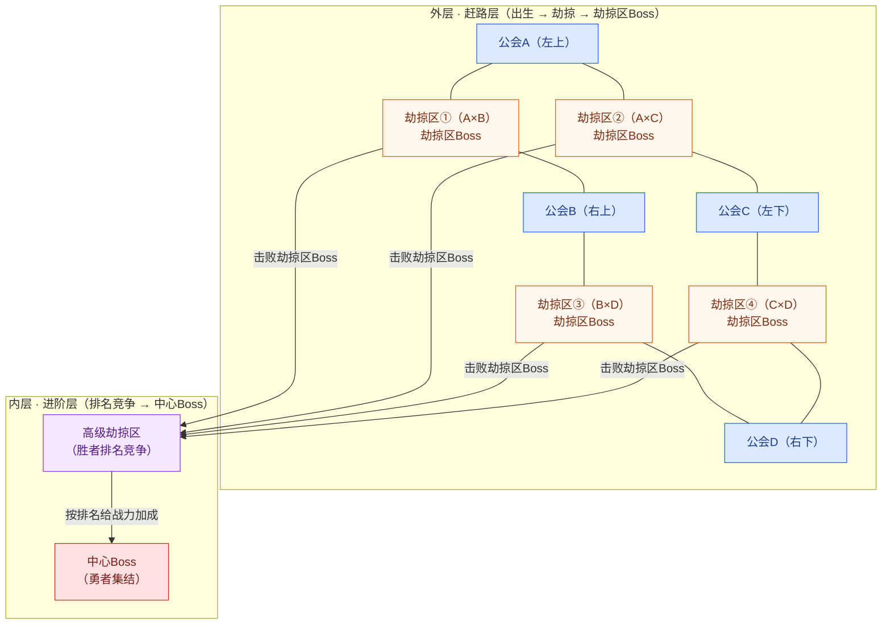

# 公会远征队玩法设计

> **设计定位**：机制骨架脱胎于 [[胡闹地牢公会贸易]]（发船 / 船长 / 排队 / 掠夺 / 分红），题材上从「公会跑商船」改为「公会组织远征队讨伐秘境」，以契合日式勇者题材。
>
> 与公会贸易的关键差异：
> 1. **袭击方为敌对公会**：把抽象的「被掠夺」升级为公会之间的 3V3 PvP 争夺；
> 2. **守备与进攻分开设置**：上人时只需排队入队；守备阵容出发前设置，进攻阵容（劫掠队）对战时才选 3 个勇者。
> 3. **四会一图 + 两层讨伐**：每次远征 4 个公会同场角逐，远征期分为赶路阶段（四会劫掠争夺）与 Boss讨伐（劫掠区Boss → 高级劫掠区 → 中心Boss）。

---

## 术语速览

| 术语              | 含义                                                   |
| --------------- | ---------------------------------------------------- |
| **槽位**          | 远征队的座位 + 奖励容器：1 个队长槽位 + 4 个队员槽位，每个槽位绑定一份货物           |
| **货品**          | 槽位货物的最小单位（金砖、宝石、金子、银子等），被劫掠时按「个」扣除                   |
| **军需**          | 远征专用资源：集结开始时按公会等级发放，会长可花钻石刷新；用于队长刷新货物、队员支援队长；下次出征时重置 |
| **守备阵容**        | 出发前设置好的防守队伍（3 勇者），被劫掠时出战                             |
| **进攻阵容（劫掠队）**   | 发起劫掠时才选的 3 勇者队伍                                      |
| **集结期 / 远征期**   | 远征的两个阶段（10 小时 / 8 小时）                                |
| **赶路阶段 / 讨伐阶段** | 远征期的两大部分：赶路阶段（四会劫掠争夺）→ 讨伐阶段（三层 Boss）                 |
| **远征积分**        | 赶路阶段由劫掠胜负累积的积分，按「边」分账，达标后解锁该边的劫掠区Boss                          |
| **劫掠区**         | 地图四条边上的遭遇节点，相邻公会在赶路阶段于此互相劫掠                          |
| **贡献度**         | 中心Boss 讨伐时成员贡献战斗力占公会总战力的比例，用于结算 Boss 奖励              |
| **劫掠区Boss**     | 每个劫掠区各一个的 PvE 门槛 Boss，积分达标解锁，击败才可进入内层                |
| **高级劫掠区**       | 劫掠区Boss 与中心Boss 之间的地带，供晋级公会进一步竞争排名与加成                |
| **高级积分**        | 高级劫掠区由劫掠胜负累积的积分，决定中心Boss战的排名与加成                      |

---

## 1. 远征队数量

- 公会每日最多可组建 1 支远征队、2 支精锐远征队。
- **每次远征由 4 个公会匹配进同一张秘境地图**：4 支来自不同公会的远征队同场角逐（见 §4 远征地图）。

## 2. 队伍结构

- 远征队由若干【槽位】组成：1 个队长槽位 + 4 个队员槽位。每个槽位既是**座位**（坐若干人），又是**奖励容器**（绑定一份货物）。

### 队长槽位（1人）

- **任职资格**：队长由会长或副会长任命，一经任命无法更换。
- **职责**：① 刷新货物；② 编排守备阵容；③ 防守迎击。

### 队员槽位（共4个，每个坐5人）

- **入队资格**：通过集结期排队并由系统随机抽取的远征成员。
- **职责**：支援队长（排队时消耗军需，影响随机入队概率）。

## 3. 守备阵容与战斗

> 战斗就是**常规 3V3 PvP**，不引入任何额外的因子/成长结算。守备与进攻分开设置。

- **守备阵容**：出发前（集结期）设置好，用于防守被劫掠；与进攻阵容相互独立。
- **进攻阵容（劫掠队）**：发起劫掠时，才从勇者库选 3 个勇者出战。
- 劫掠 = 进攻方 3 勇者 vs 防守方守备阵容 3 勇者的常规 3V3 战斗（范式 / 元素克制，见 [[3V3组队规划表：范式与克制关系]]）。
- **每次劫掠均满编出战**；被击败的勇者**可以再次出战**（无战损、无轮换消耗）。

## 4. 远征地图（四会一图·两层）

> **机制说明**：每次远征，4 个公会匹配进同一张秘境地图，从四角出发向中心推进。地图分为**外层（赶路层）**与**内层（进阶层）**两层。

**外层（赶路层）**
- **四角**：4 个公会的出生点，各自独立推进。
- **四边**：4 条赶路路径，每条边中部设一个 **劫掠区**——相邻两公会的遭遇节点，赶路阶段在此互相劫掠。
- **劫掠区Boss**：每个劫掠区各一个，位于劫掠区通往内层的交界处，积分达标解锁（见 §8）。
- **地图为公会视角**：每个玩家只看到自己公会在各边上的 Boss 积分进度条（攒满解锁该边 Boss），非本公会的边灰显。
- 相邻公会两两互为可劫掠对象（A↔B、A↔C、B↔D、C↔D）；对角公会（A↔D、B↔C）在赶路阶段不直接相遇。

**内层（进阶层）**
- **高级劫掠区**：劫掠区Boss 与中心Boss 之间的地带，供上一轮获胜公会进一步竞争。
- **中心Boss**：最终讨伐节点，只有击败劫掠区Boss 的公会才能抵达。
- 推进路径：**角落 → 劫掠区 → 劫掠区Boss → 高级劫掠区 → 中心Boss**。

![[公会远征地图.png]]

> 单次远征的完整秘境地图（公会A 视角）：四角出生 → 四边劫掠区 → 劫掠区Boss（PvE门槛）→ 高级劫掠区（胜者排名）→ 中心Boss（勇者集结）。地图按玩家公会视角显示——自己所在边画出 **Boss 积分进度条**（攒满解锁对应劫掠区Boss），非本公会的边灰显。

**单公会路径**：出生（四角）→ 赶路劫掠（与相邻公会）→ 积分达标 → 击败劫掠区Boss → 进入高级劫掠区（与胜者排名竞争）→ 按排名获战力加成 → 勇者集结讨伐中心Boss。

## 5. 分红规则

> 奖励跟槽位绑定：每个槽位绑定一份货物（如 5 金砖），凯旋时槽位内的人平分该槽位剩余货物。
> 讨伐奖励另计，见 §8 Boss讨伐。

- **队员**：凯旋时获得两部分——
  1. 所在槽位剩余的货物，槽位内的人平分（若该槽位未被劫掠）；
  2. 远征途中从别人那里劫掠来的东西（个人劫掠所得，归个人）。
- **队长**：获得队长槽位的货物（独占）+ 远征结束后系统单独发放的一份队长奖励（作为任命与职责的回报）。
- **被劫掠**：敌对公会劫掠成功时，劫走 3-6 个货品（从**受害者所在槽位**的货物中扣除）；高级劫掠区则为 5-8 个，并可额外夺走对方的「晋级货物」。
- **凯旋** → 按「槽位货物平分 + 个人劫掠所得」结算。
- **讨伐奖励** → 击败劫掠区Boss 晋级中心Boss 的公会，按成员【贡献度】发放 Boss 奖励（见 §8 Boss讨伐）。

## 6. 远征流程

远征全过程分为两个阶段：集结期 → 远征期；其中远征期又分为**赶路阶段 → 劫掠区Boss → 高级劫掠区 → 中心Boss**四个环节。

### 集结期（持续10小时）

任命队长后，正式进入集结期：

- **军需发放**：集结开始时，按公会等级发放【军需】（公会等级越高，初始军需越多），会长可花费钻石刷新军需。军需在下次出征时重置，不跨期保留。
- **货物刷新**：前 8 小时内，队长可消耗【军需】刷新各槽位带出去的货物——每个槽位绑定一份货物（如槽位 1 = 5 宝石 + 5 金子、槽位 2 = 10 银子）。累计刷新 5 次触发额外惊喜奖励。
- **成员排队**：成员自由选择队员槽位（1~4 号）排队，期间可随时更换队伍。
- **设置守备阵容**：出发前，成员（含队长）设置好自己的守备阵容（3 个勇者，防守用，与进攻阵容分开）。
- **支援队长**：排队时可消耗【军需】支援队长，支援数量影响随机入队概率。
- **确定入队**：集结期结束时，系统在每个槽位队列中随机抽取 5 名成员。

### 远征期（持续8小时）

远征队进入秘境，与另外 3 个公会同场角逐，依次经历四个环节：

- **赶路阶段**：4 个公会沿四条边向中心推进，在 **劫掠区** 互相劫掠并累积【远征积分】（见 §7 劫掠机制）。
- **劫掠区Boss**：公会【远征积分】达标即解锁对应边的 **劫掠区Boss**（PvE 门槛），击败后进入内层（见 §8.1）。
- **高级劫掠区**：击败劫掠区Boss 的公会在此进一步竞争，决定中心Boss战的排名与加成（见 §8.2）。
- **中心Boss**：晋级公会以「勇者集结」讨伐中心Boss（见 §8.3）。

- 每支远征队最多被劫掠 3 次，每次劫掠失败（守备败）将随机损失 3-6 个货品。
- 各环节时长待定档（见 §10）。
- 结算后，按 §5 分红规则发放奖励。

## 7. 劫掠机制（赶路阶段·四会混战）

> **题材锚定**：4 个公会的远征队进入同一秘境，秘境资源有限，公会之间自然互相争夺。劫掠 = 敌对公会抢夺你远征队的战利品。

### 7.1 发起劫掠

- 赶路阶段，成员可消耗【劫掠次数】对**相邻公会**发起劫掠（对标 [[胡闹地牢公会争霸规则]] §3 的进攻次数，每日重置）。
- 劫掠方派出 3 个勇者组成【劫掠队】——**与守备方完全一致的 PvP 对抗，双方都用勇者**。
- **劫掠对象是固定配对，不是随机匹配**：由地图四边决定，公会只能劫掠相邻的两家（A↔B、A↔C、B↔D、C↔D），对角公会不遇。
- **玩家怎么知道劫掠谁**：界面列出相邻两公会的远征队作为可选目标，并标注「袭击谁 → 攒哪条边的 Boss 积分」，玩家（或公会指挥）自由选择劫掠哪一边。
- **UI 包装为「袭击」**：玩家扮演**袭击者**，界面呈现为「**袭击远征队 · 挑选袭击目标**」——先选袭击哪支远征队，再从中挑选受害者。

> **玩家视角示例（公会A 队员）**：打开「袭击远征队」界面，看到两个可选目标——相邻公会 B 与 C 的远征队（对角 D 不可选）。界面标注「袭击 B 队 → 累积劫掠区①（A×B）积分」「袭击 C 队 → 累积劫掠区②（A×C）积分」。选定远征队后，再从中**挑选受害者**（具体成员），攒满该边积分即解锁对应劫掠区Boss。

![[公会远征队_袭击目标选择界面.png]]

> 界面参考（线框草图）：「袭击远征队 · 挑选袭击目标」——玩家是袭击者，先选相邻公会远征队，再从中挑选受害者。

### 7.2 战斗结算

- 劫掠 = 一场常规 3V3 自动战斗（3-6 回合；神明以援护动作参战，不做场上单位）。
- **袭击者挑选受害者**：发起袭击时，袭击者从对方远征队中选定一个成员（受害者），由该受害者的守备阵容满编出战防守；界面会展示各候选成员的所在槽位与货物，供袭击者挑「肥」的抢。
- **劫掠方胜** → 掠夺 3-6 个货品（并入劫掠方自己的战利品，从受害者所在槽位扣除），并为公会累积【远征积分】。
- **防守方胜** → 无损失，并为公会累积少量【远征积分】（奖励防守）。
- 每支远征队最多被劫掠 3 次，达到 3 次后本场不再被匹配为劫掠目标。

### 7.3 远征积分与解锁（分边记账）

- 【远征积分】**按「边」分账**：劫掠/防守发生在哪条边，积分就记到哪条边的劫掠区Boss。
  - 例：公会A 劫掠 C → 记入 A×C 边（劫掠区②）；劫掠 B → 记入 A×B 边（劫掠区①）。
  - 防守成功同理：B 来劫掠 A 且 A 守备胜 → 记入 A×B 边；C 来劫掠 A 且 A 守备胜 → 记入 A×C 边。
- 每条边积分 = 该边劫掠成功所得（按掠夺货品价值折算）+ 该边防守成功奖励。
- 某条边积分达到阈值 → 解锁该边的 **劫掠区Boss**（见 §8.1）。每个公会最多两条边（两个 Boss 候选），击败任意一个即晋级内层。
- 积分不设排名淘汰：达标即有机会晋级；未达标的公会止步赶路，仅保留劫掠所得并发放参与奖励。

## 8. Boss讨伐（三层：劫掠区Boss → 高级劫掠区 → 中心Boss）

> **机制说明**：讨伐分三层——先过劫掠区Boss门槛，再在高级劫掠区竞争排名，最后勇者集结讨伐中心Boss。

### 8.1 劫掠区Boss（PvE门槛）

- 每个 **劫掠区** 各有一个 **劫掠区Boss**，位于劫掠区通往内层的交界处。
- **解锁条件**：该边【远征积分】达到阈值（分边记账，见 §7.3）。
- **性质**：PvE 门槛——不直接淘汰其他公会，达标即可挑战，击败即晋级。
- **个人门槛**：同一条边的两个公会（如 A、B 之于劫掠区①）各自独立挑战、互不消耗，先解锁先打。
- 每个公会最多可解锁自己两条边上的 Boss，击败任意一个即进入内层；击败两个 Boss 可额外多拿一份晋级货物。
- 击败劫掠区Boss → 公会进入内层，解锁高级劫掠区与中心Boss挑战资格。
- **晋级货物**：击败劫掠区Boss 后，远征队**额外装车一批晋级奖励**（Boss 掉落 + 晋级货物），随队带入内层，使进入高级劫掠区的远征队成为高价值劫掠目标。

### 8.2 高级劫掠区（胜者竞争·排名与加成）

- 击败劫掠区Boss 的公会进入 **高级劫掠区**（劫掠区Boss 与中心Boss 之间的地带），晋级的公会之间在此进行新一轮劫掠竞争。

**竞争方式**
- 复用 3V3 PvP，烈度/收益高于赶路阶段：劫掠成功掠夺 5-8 个货品（赶路阶段为 3-6 个）。
- **晋级货物争夺**：晋级公会都随身携带击败劫掠区Boss 后获得的「晋级货物」，劫掠成功可额外夺走对方的晋级货物——大家身上都有「肥肉」，劫掠动力显著高于赶路阶段。
- 劫掠 / 防守成功均累积【高级积分】，数值高于赶路阶段的【远征积分】；高级积分为**单池**（全公会统一排名，不再按边分账）。
- 高级劫掠区为新一轮，劫掠次数重新计算；每支远征队在此最多被劫掠 3 次。

**排名**
- 阶段结束按【高级积分】降序排名；积分相同则按赶路阶段【远征积分】高者靠前，再同则按劫掠区Boss击杀用时短者靠前。

**加成（示意值，待数值定档）**
- 排名决定中心Boss战「勇者集结」的**公会总战力加成**：

| 排名 | 公会总战力加成 |
|------|--------------|
| 第1名 | +15% |
| 第2名 | +10% |
| 第3名 | +5% |
| 第4名 | 0% |

- **不淘汰**：所有晋级公会都能打中心Boss，排名只影响加成幅度。

### 8.3 中心Boss（勇者集结）

- 只有击败劫掠区Boss 的公会才能挑战中心Boss。
- 公会成员派出勇者「集结」——提交这部分勇者的战斗力，计入公会总战力；每位成员可多轮提交。
- 公会总战力 = 全体集结成员提交战斗力之和，对中心Boss 造成等额伤害，血量归零即讨伐成功；高级劫掠区排名带来加成。
- **讨伐成功** → 参与集结的成员按【贡献度】发放奖励；**阶段结束未讨伐成功** → 按已造成伤害比例发放部分奖励。
- 【贡献度】 = 个人提交战斗力 ÷ 公会总战力，决定个人奖励梯度；未参与集结者不获奖励（防挂机白嫖）。
- 各晋级公会独立结算，互不影响。

## 9. 远征队特权

> 公会贸易原文只说「公会等级达到特定等级时解锁对应特权，豪华邮轮默认激活全部」，没有展开具体是什么。这里把「特权」具体化。

**机制说明**：
- 特权 = 远征队的一批「升级项」，只作用于**普通远征队**。
- 公会达到特定等级 → 依次解锁这些特权。
- **精锐远征队默认直接激活全部特权**——这正是「精锐」与「普通」的核心差异：普通远征队靠公会等级慢慢解锁，精锐远征队开出来就是满配。

**具体特权（等级阈值为示意，待数值定档）**：

| 公会等级 | 特权 | 效果 |
|----------|------|------|
| 初始 | 基础组建 | 每日可组 1 支远征队；槽位基础货品数 |
| Lv.5 | 槽位扩容 | 可携带槽位数 +2（更多货物空间） |
| Lv.10 | 货品扩容 | 每个槽位绑定的货品数 +2 |
| Lv.15 | 军需储备 | 集结开始时军需 +20% |
| Lv.20 | 守备加固 | 防守战斗获得 5% 数值加成 |
| Lv.25 | 惊喜加码 | 刷新 5 次触发的惊喜奖励品质提升 |
| Lv.30 | 双队齐发 | 每日可组远征队 +1 |

> 待数值定档：各特权解锁的准确公会等级、数值幅度（+2 货品 / +20% 军需 / 5% 守备加成等）。

## 10. 待细化区域

| 区域 | 待定 |
|------|------|
| 槽位货品数量 | 每个槽位绑定多少货品（决定被劫掠时的可扣基数） |
| 槽位货物表 | 各槽位绑定货品（宝石/金子/银子/金砖等）的具体刷新池与稀有度分布 |
| 队长单独奖励 | 系统单独发放给队长的奖励具体内容与数额（建议与职责挂钩：刷新次数 / 防守胜负） |
| 精锐远征队差异 | 除全特权外，是否上调货品数量 / 槽位数量 / 劫掠上限 |
| 劫掠匹配 | 同场为 4 公会固定匹配；待定跨场匹配池规则（随机 / 段位 / 公会等级） |
| 阶段时长拆分 | 远征期 8 小时内「赶路 / 劫掠区Boss / 高级劫掠区 / 中心Boss」四环节的时长 |
| 远征积分数值 | 劫掠成功 / 防守成功各自的积分值、与货品价值的折算比例、解锁劫掠区Boss的阈值 |
| 劫掠区Boss 数值 | 各劫掠区Boss 的血量、挑战消耗、4 个是否同数值 |
| 高级劫掠区数值 | 高级积分具体值、加成幅度（+15%/+10%/+5%）、掠夺货品数（5-8）、晋级货物数量与价值定档 |
| 中心Boss 数值 | 中心Boss 血量、公会总战力与伤害的换算、集结轮次上限 |
| 中心Boss 奖励池 | 中心Boss 掉落内容与按贡献度的梯度分配表 |
| 败者公会奖励 | 止步赶路（未达标 / 劫掠区Boss失败）公会的参与奖励内容 |
