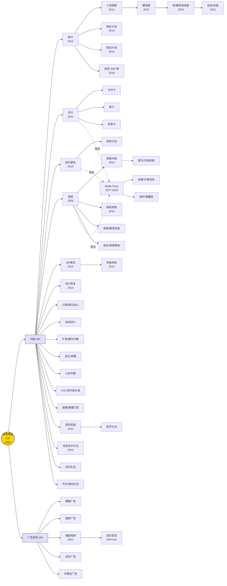
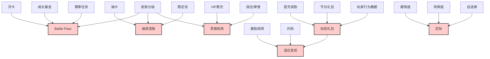

> ⚠️ **参考项**：本文档为外部手游商业化机制的全景梳理，内容为设计参考，**不是本游戏的正式商业化设计文档**。本游戏的商业化以正式立项文档为准。

# 手游商业化机制全景图谱

> 把所有主流商业化手段放进一张关系网里，看清**谁衍生自谁、谁与谁组合、谁替代了谁**，为后续逐项深挖提供导航。
>
> 配套阅读：[[手游商业化创新演进史：从月卡到保底]]

---

## 〇、图谱的三个维度

一张能用的全景图，必须同时回答三个问题：

| 维度 | 问题 | 图谱中的表达 |
|------|------|-------------|
| **分类** | 这个机制本质上在卖什么？ | 按变现对象分七大支系 |
| **演进** | 这个机制是从哪个旧机制长出来的？ | 箭头指向"父机制 → 子机制" |
| **组合** | 这个机制是不是 A+B 的产物？ | 组合关系图 |

---

## 一、核心分类：七大支系

所有手游商业化机制，按"本质上在卖什么"可分为七类：

| 支系 | 变现对象 | 核心交易 | 代表机制 |
|------|---------|---------|---------|
| **A. 内容获取** | 角色/卡牌/装备 | 钱 → 获取机会（概率） | 抽卡、保底、限定池、定轨 |
| **B. 周期权益** | 持续领取权 | 钱 → 未来 N 天的领取资格 | 月卡、成长基金、终身卡、战令 |
| **C. 外观身份** | 装饰 / 阶层符号 | 钱 → 视觉差异化 / 身份资本 | 皮肤分级、贵族系统、抽奖皮肤 |
| **D. 便捷功能** | 时间 / 操作成本 | 钱 → 跳过等待 / 自动化 | 扫荡、体力恢复、加速、扩容 |
| **E. 注意力** | 观看广告的注意力 | 注意力 → 资源 | 激励视频、插屏、试玩广告 |
| **F. 社交关系** | 关系投资 / 集体目标 | 钱 → 赠予 / 共建 / 分成 | 送礼、公会战、UGC 分成 |
| **G. 限时优惠** | 价格差感知 | 钱 → "省到了"的心理满足 | 动态礼包、回归礼包、限时弹窗 |

> 💡 **洞察**：七大支系对应七种**不同的玩家付费动机**。一个成熟商业化游戏通常会同时铺设 4-6 个支系，覆盖不同付费层与动机类型。

---

## 二、主演进图谱

下图展示各机制的**衍生关系**（谁长自谁）：



> 📌 **阅读说明**：实线 = 衍生关系（子机制由父机制演化而来）；虚线 `.组合.` = 该机制是多个父机制的组合产物。

---

## 三、组合关系图：哪些机制是"A + B"的产物

有些机制并非凭空出现，而是**多个旧机制的重组**。这些组合点往往是创新的高发区：



> 💡 **创新规律**：**下一代创新往往不是新支系，而是旧支系的交叉组合**。Battle Pass = 月卡 × 皮肤 × 赛季任务；抽奖皮肤 = 抽卡 × 皮肤分级 × 限定。寻找尚未被组合的支系对，是创新的捷径。

---

## 四、演进链：六条主线

把图谱里的箭头抽出来，能看出六条清晰的**单线演进链**：

### 链 1：抽卡的概率控制演进
```
抽卡(2012) → 十连保底(2013) → 硬保底(2015) → 软/硬双层保底(2020) → 定轨/命座(2021)
   └────────────→ 自选SSR券(2018)  ←────并行分支
```
**演进逻辑**：每一代都在**收紧"无底洞"的下限**，把赌博重新包装成"有上限的高价购买"。

### 链 2：周期付费的锁定深度演进
```
月卡(2011) → 大月卡 → 成长基金(2013) → 终身卡 → 平台订阅(Apple Arcade)
```
**演进逻辑**：每一代都在**延长玩家的预付费周期**，从 30 天到终身到跨游戏。

### 链 3：外观的阶层化演进
```
皮肤(2009) → 皮肤分级(2014) → 抽奖皮肤(2016) → 星元/升级皮肤 → 绝版/赛季限定
```
**演进逻辑**：每一代都在**制造更强的稀缺性与可升级性**，拉长单次外观的 LTV。

### 链 4：身份系统的可见化演进
```
VIP累充(2010) → 贵族系统(2015) → 段位荣誉特权 → 排行榜专属资产
```
**演进逻辑**：每一代都在**把消费更公开地"显示"出来**，从私有特权到社交可见。

### 链 5：广告与内购的融合演进
```
横幅/插屏(2009) → 激励视频(2012) → 试玩广告 → 混合变现(IAP+IAA) → 广告去内购
```
**演进逻辑**：广告从"打扰"变成"可选交易"，最终与内购**融合为统一变现层**。

### 链 6：礼包的精准化演进
```
首充奖励(2012) → 新手礼包 → 节日礼包 → 回归礼包 → 动态定价礼包(2015)
```
**演进逻辑**：每一代都在**更精准地识别玩家状态**，从"所有人一样"到"千人千面"。

---

## 五、替代与互补关系

有些机制之间不是衍生，而是**替代**或**互补**：

| 关系 | 机制对 | 说明 |
|------|--------|------|
| **替代** | 买断制 ↔ F2P 内购 | 平台与品类选择，非此即彼 |
| **替代** | VIP 累充 ↔ Battle Pass | VIP 锁大 R，战令锁中低付费；战令兴起部分替代了 VIP 的中低层功能 |
| **替代** | 抽卡 ↔ 自选 SSR 券 | 自选券是抽卡的"反叛"，给玩家确定性 |
| **互补** | 月卡 + Battle Pass | 月卡提供货币，战令消耗货币，形成闭环 |
| **互补** | 抽卡 + 限定池 + 保底 | 三者缺一不可，组合才构成现代抽卡体系 |
| **互补** | 激励视频 + 内购 | 广告转化免费用户，内购转化付费用户，分层不冲突 |
| **冲突** | VIP 累充 + 监管 | 累充诱导消费在国内受限，需改造 |

> 💡 **设计启示**：选机制时不能只看"加什么"，还要看**它和已有机制是互补还是冲突**。一个游戏的商业化结构应该是**自洽的生态**，而非机制的堆砌。

---

## 六、按"玩家付费动机"重新切片

同一张图谱，按**玩家为什么付钱**重新切片，能看到不同的分布：

| 付费动机 | 对应机制 | 玩家画像 |
|---------|---------|---------|
| **"我想要那个角色"** | 抽卡、保底、限定池、定轨、自选券 | 收集型玩家 |
| **"我不想等"** | 体力恢复、扫荡、加速、扩容 | 效率型玩家 |
| **"我想与众不同"** | 皮肤分级、星元、绝版皮肤、抽奖皮肤 | 表达型玩家 |
| **"我想被看见"** | 贵族系统、排行榜、段位特权 | 竞争型/社交型玩家 |
| **"我占了便宜"** | 月卡、成长基金、Battle Pass、动态礼包 | 理性型玩家 |
| **"我送给朋友"** | 送礼、转赠、CP 外观 | 关系型玩家 |
| **"我不想花钱，但愿意花时间"** | 激励视频、混合变现 | 免费玩家 |

> 💡 **启示**：**好的商业化设计，要为每一种动机都留一扇门**。只覆盖 2-3 种动机的游戏，必然流失其他动机的玩家。

---

## 七、机制的全景清单（索引表）

下表是所有机制的**速查索引**，标注所属支系、出现时间、是否已分析。

| 机制 | 支系 | 出现时间 | 已深挖？ |
|------|:---:|:---:|:---:|
| 道具收费 / F2P | 根 | 2009 | ✓ |
| 月卡 | B | 2011 | ✓ |
| 抽卡 / Gacha | A | 2012 | ✓ |
| 保底（三代） | A | 2013→2020 | ✓ |
| Battle Pass | B+C 组合 | 2017-2018 | ✓ |
| VIP 累充 | C | 2010 | ✓ |
| 十连保底 | A | 2013 | 部分 |
| 硬保底 | A | 2015 | 部分 |
| 软/硬双层保底 | A | 2020 | 部分 |
| 定轨 / 命座 | A | 2021 | 待挖 |
| 自选 SSR 券 | A | 2018 | 待挖 |
| 限定卡池 | A | 2013 | 待挖 |
| 联动卡池 | A | 2014 | 待挖 |
| 抽卡货币可累积性 | A | — | 待挖 |
| 成长基金 / 投资计划 | B | 2013 | 待挖 |
| 终身卡 | B | — | 待挖 |
| 大月卡 / 周卡 | B | — | 待挖 |
| 平台订阅（Apple Arcade 等） | B | 2019 | 待挖 |
| 皮肤分级体系 | C | 2014 | 待挖 |
| 抽奖皮肤 | C | 2016 | 待挖 |
| 星元 / 升级皮肤 | C | — | 待挖 |
| 绝版 / 赛季限定皮肤 | C | — | 待挖 |
| 贵族系统 | C | 2015 | 待挖 |
| 段位 / 荣誉特权 | C | — | 待挖 |
| 排行榜专属资产 | C | — | 待挖 |
| 动态定价弹窗礼包 | G | 2015 | 待挖 |
| 限时倒计时礼包 | G | — | 待挖 |
| 回归礼包 | G | — | 待挖 |
| 首充奖励 | G | 2012 | 待挖 |
| 节日 / 限时礼包 | G | — | 待挖 |
| 扫荡 / 跳过战斗 | D | — | 待挖 |
| 体力恢复 | D | 2010 | 待挖 |
| 自动战斗 / 加速 | D | — | 待挖 |
| 扩容 / 额外次数 | D | — | 待挖 |
| 激励视频广告 | E | 2012 | 待挖 |
| 混合变现（IAP+IAA） | E | 2018+ | 待挖 |
| 插屏 / 横幅 / 试玩广告 | E | 2009+ | 待挖 |
| 付费去广告 | E | — | 待挖 |
| 送礼 / 转赠 | F | — | 待挖 |
| 公会共建付费 | F | — | 待挖 |
| UGC 创作者分成 | F | 2015+ | 待挖 |
| 直播 / 赛事打赏 | F | — | 待挖 |
| 玩家间拍卖行 + 抽成 | F | — | 待挖 |
| 大转盘 / 幸运转盘 | A+G | — | 待挖 |
| 集字 / 拼图活动 | A+G | — | 待挖 |
| 签到付费升级 | B+G | — | 待挖 |
| NFT / Web3 经济 | 跨界 | 2021+ | 待挖 |

---

## 八、后续深挖路线图

基于图谱，建议按以下顺序深挖（已在 [[手游商业化创新演进史：从月卡到保底]] 中分析的 5 项不重复）：

### 第一批：高频出现、影响结构
1. 限定卡池 + 联动池（一起分析，稀缺性制造）
2. 成长基金 / 投资计划（周期权益的精妙变种）
3. 动态定价弹窗礼包（暗黑设计代表）
4. 皮肤分级 + 抽奖皮肤 + 星元（外观 LTV 三件套）

### 第二批：机制变体与边界
5. 定轨 / 命座系统（保底的再进化）
6. 贵族系统（VIP 的社交可见化升级）
7. 激励视频 + 混合变现（独立变现逻辑）
8. 终身卡（极端锁定机制）

### 第三批：长期生态与前沿
9. UGC 创作者分成
10. 玩家间送礼 / 转赠
11. NFT / Web3 经济（争议但值得研究）
12. 大转盘 / 集字活动（活动型变现）

---

> 📌 **图谱用法**：后续每深挖一个机制，回链到本图谱对应节点，逐步把"待挖"标记为"已挖"，最终形成一份完整的商业化机制知识库。
