# 第七史诗 设计准则：轴关系图谱

> 用图形表达 E7 8 个设计轴之间的关系、克制网络、团队形成规则。
> 所有图示使用 Mermaid——Obsidian 原生渲染。
> 配套文档：[[第七史诗_设计准则_反向推演]]、[[第七史诗_主流队伍与机制分析]]

---

## 图一：E7 英雄设计 8 轴全景

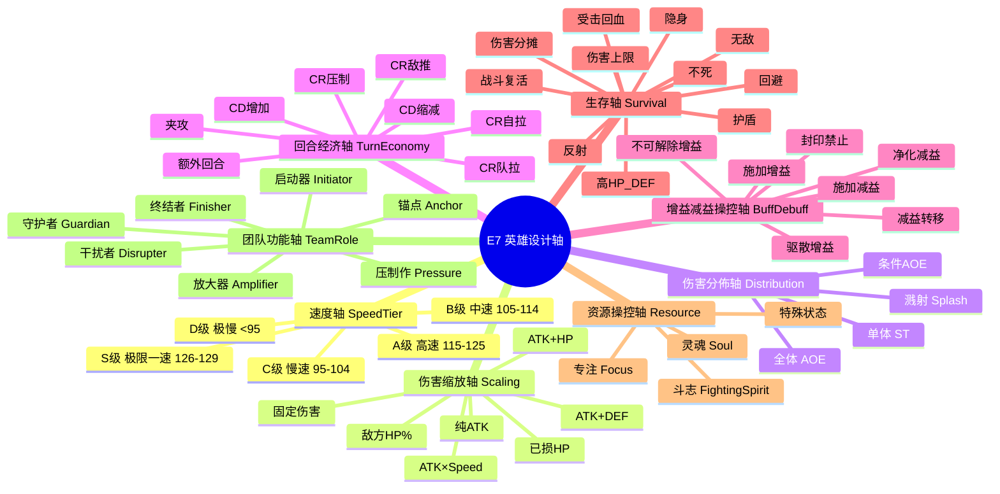

---

## 图二：速度轴——统治一切的元规则

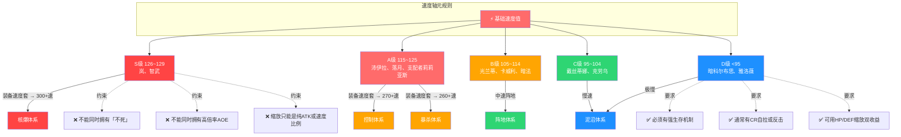

---

## 图三：跨轴克制网络（完整版）

```mermaid
graph TB
    subgraph 速度轴
        FAST["🚀 高速队<br/>核爆/控制"]
        SLOW["🐢 低速队<br/>阵地/泥沼"]
    end

    subgraph 反速机制
        ANTISPEED1["佛里蒂丝<br/>敌CR获取-50%"]
        ANTISPEED2["伯里安<br/>禁魂"]
        ANTISPEED3["深渊优芬妮<br/>速攻效果-30%"]
    end

    subgraph 增益减益轴
        BUFF["施加增益"]
        STRIP["驱散增益"]
        DEBUFF["施加减益"]
        CLEANSE["净化减益"]
        SEAL["封印被动"]
        UNDISPEL["不可解除增益"]
        RESTRICT["束缚 禁拉条"]
        IMMUNITY["免疫"]
        UNBUFFABLE["无法强化"]
        UNHEALABLE["禁疗"]
        NOCOUNTER["无法反击"]
    end

    subgraph 伤害缩放轴
        ATK["纯ATK缩放"]
        HPSCALE["HP缩放<br/>装备双收益"]
        DEFSCALE["DEF缩放<br/>装备双收益"]
        SPDSCALE["速度比例"]
        PEN["穿透"]
        DEFBREAK["破甲-70%"]
        POISON["中毒 5%HP<br/>无视防御"]
        CRITRES["暴击抗性"]
        CRITDMGRED["暴伤减免"]
        PENRES["穿透抗性"]
    end

    subgraph 生存轴
        EVADE["回避"]
        LOCK["锁定 回避=0%"]
        DEFENSE["高防御"]
        REVIVE["复活"]
        EXTINCT["灭亡"]
        NORES["禁复活"]
        IMMORTAL["不死"]
        SHIELD["护盾"]
        DMGCAP["伤害上限"]
        MULTIHIT["多段攻击"]
        DOTS["DOT<br/>烧伤/流血/中毒"]
        INVIS["隐身"]
        AOE["AOE 伤害"]
        AOERED["AOE减伤<br/>艾蕾娜"]
        REFLECT["反射"]
        COUNTER["反击"]
        ROANA["罗安娜<br/>反额外攻击"]
        DMGNULL["技能伤害无效"]
        INVINCIBLE["无敌"]
        DSHIELD["护盾→100%穿透<br/>赛珂蕾特"]
    end

    FAST --"克制"--> SLOW
    SLOW --"通过反速机制反击"--> FAST
    ANTISPEED1 --> FAST
    ANTISPEED2 --> FAST
    ANTISPEED3 --> FAST

    BUFF --"被克制"--> STRIP
    BUFF --"被克制"--> UNBUFFABLE
    STRIP --"被克制"--> UNDISPEL
    DEBUFF --"被克制"--> CLEANSE
    DEBUFF --"被克制"--> IMMUNITY
    CLEANSE --"被克制"--> SEAL
    SEAL --"克制"--> BUFF
    RESTRICT --"克制"--> SLOW
    UNHEALABLE --"克制"--> SLOW
    NOCOUNTER --"克制"--> COUNTER

    ATK --"被克制"--> HPSCALE
    ATK --"被克制"--> DEFSCALE
    HPSCALE --"被克制"--> PEN
    HPSCALE --"被克制"--> POISON
    DEFSCALE --"被克制"--> DEFBREAK
    DEFSCALE --"被克制"--> POISON
    SPDSCALE --"克制"--> HPSCALE
    SPDSCALE --"克制"--> DEFSCALE
    PEN --"被克制"--> PENRES
    DEFBREAK --"被克制"--> IMMUNITY

    EVADE --"被克制"--> LOCK
    EVADE --"被克制"--> AOE
    DEFENSE --"被克制"--> PEN
    DEFENSE --"被克制"--> DEFBREAK
    DEFENSE --"被克制"--> POISON
    REVIVE --"被克制"--> EXTINCT
    REVIVE --"被克制"--> NORES
    IMMORTAL --"被克制"--> EXTINCT
    IMMORTAL --"被克制"--> MULTIHIT
    SHIELD --"被克制"--> PEN
    SHIELD --"被克制"--> STRIP
    SHIELD --"被克制"--> DSHIELD
    DMGCAP --"被克制"--> MULTIHIT
    DMGCAP --"被克制"--> DOTS
    INVIS --"被克制"--> AOE
    AOE --"被克制"--> AOERED
    REFLECT --"被克制"--> PEN
    COUNTER --"被克制"--> NOCOUNTER
    COUNTER --"被克制"--> ROANA
    COUNTER --"被克制"--> SEAL
    DMGNULL --"被克制"--> MULTIHIT
    INVINCIBLE --"被克制"--> STRIP

    style FAST fill:#ff6b6b,color:#fff
    style SLOW fill:#1e90ff,color:#fff
    style PEN fill:#ff4444,color:#fff
    style DEFBREAK fill:#ff4444,color:#fff
    style EXTINCT fill:#ff4444,color:#fff
    style NORES fill:#ff4444,color:#fff
    style LOCK fill:#ff4444,color:#fff
    style SEAL fill:#e67e22,color:#fff
    style MULTIHIT fill:#e67e22,color:#fff
    style DOTS fill:#e67e22,color:#fff
    style NOCOUNTER fill:#e67e22,color:#fff
    style ROANA fill:#00b894,color:#fff
```

---

## 图四：队伍 Feed 链——快→慢的方向性

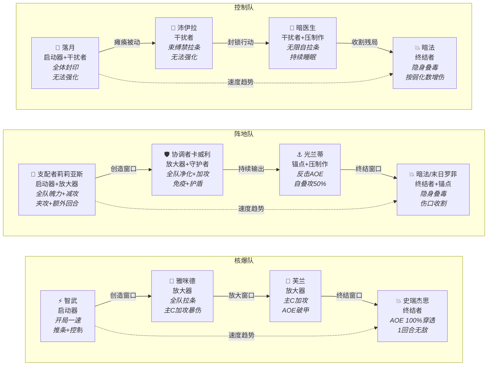

---

## 图五：全对策闭环（含生存/反击/暴击/隐身/无敌/反射/控制）

> 🔚 = 对策链到此终止（无进一步反制手段）

```mermaid
flowchart LR
    subgraph 回避链
        EV["回避<br/>概率完全闪避"] -->|"被克制"| LK["锁定<br/>闪避强制0%"]
        EV -->|"被克制"| AOE1["AOE<br/>不受回避影响"]
        LK -->|"被克制"| NS["不可被锁定<br/>（暂无用例）"]
    end

    subgraph 防御链
        DF["高防御<br/>DEF/300+DEF"] -->|"被克制"| PB["破甲-70%"]
        PB -->|"被克制"| IM["免疫"]
        DF -->|"被克制"| PN["穿透"]
        PN -->|"被克制"| PA["穿透抗性<br/>苍穹伊莉娜芙"]
        DF -->|"被克制"| PS["中毒<br/>无视防御"]
    end

    subgraph 不死链
        IM1["不死<br/>HP保留1"] -->|"被克制"| EX1["灭亡<br/>击杀不可复活"]
        IM1 -->|"被克制"| MH1["多段攻击<br/>破不死+追击"]
        EX1 -->|"🔚 无反制"| END1(("🔚"))
    end

    subgraph 复活链
        RV["复活<br/>戴丝蒂娜/光之瑞儿"] -->|"被克制"| EX2["灭亡"]
        RV -->|"被克制"| NR["禁复活<br/>罪戾安洁莉卡<br/>灰光伊赛丽亚"]
        EX2 -->|"🔚 无反制"| END2(("🔚"))
        NR -->|"🔚 无反制"| END3(("🔚"))
    end

    subgraph 护盾链
        SD["护盾<br/>吸收伤害"] -->|"被克制"| PN2["穿透"]
        SD -->|"被克制"| SP["护盾→100%穿透<br/>操作员赛珂蕾特"]
        SD -->|"被克制"| ST["驱散"]
        ST -->|"被克制"| UD1["不可解除增益"]
    end

    subgraph 伤害上限链
        DC["伤害上限<br/>单次≤HP的N%"] -->|"被克制"| MH2["多段攻击<br/>每段独立触发上限"]
        DC -->|"被克制"| DT["DOT<br/>烧伤/流血/中毒"]
    end

    subgraph 反击链
        CTR["反击<br/>查尔斯/武斗家肯恩"] -->|"被克制"| NC["无法反击<br/>审判者绮世"]
        CTR -->|"被克制"| RNA["罗安娜被动<br/>队友受额外攻击→<br/>全队回血+拉条"]
        NC -->|"被克制"| FC["强制反击<br/>深渊优芬妮<br/>来源被动→不可禁止"]
        FC -->|"被克制"| SEAL1["封印被动<br/>落月"]
        SEAL1 -->|"🔚 近乎无对策"| END4(("🔚"))
    end

    subgraph 暴击链
        CRT["暴击/暴伤<br/>核心输出维度"] -->|"被克制"| CRES["暴击抗性提升<br/>Choux/迪埃妮"]
        CRT -->|"被克制"| CDR["暴伤减免<br/>年轻女王夏绿蒂"]
    end

    subgraph 隐身链
        INV["隐身<br/>无法被单体指定"] -->|"被克制"| AOE2["AOE<br/>无视隐身"]
        INV -->|"被克制"| DSP["驱散隐身<br/>米莉姆龙眼"]
    end

    subgraph 反射链
        REF["反射伤害<br/>尤哈/皇家卫兵"] -->|"被克制"| PN3["穿透<br/>反射伤害也减免"]
        REF -->|"被克制"| FD["固定伤害<br/>不可反射"]
    end

    subgraph 无敌链
        IV["无敌<br/>免疫所有伤害1T"] -->|"被克制"| ST2["驱散"]
        IV -->|"被克制"| SEAL2["封印施法者被动"]
        ST2 -->|"被克制"| UD2["不可解除增益"]
    end

    style EV fill:#a29bfe,color:#fff
    style DF fill:#74b9ff,color:#fff
    style IM1 fill:#fd79a8,color:#fff
    style RV fill:#00b894,color:#fff
    style SD fill:#fdcb6e,color:#333
    style DC fill:#e17055,color:#fff
    style CTR fill:#a29bfe,color:#fff
    style CRT fill:#74b9ff,color:#fff
    style INV fill:#fd79a8,color:#fff
    style REF fill:#00b894,color:#fff
    style IV fill:#fdcb6e,color:#333
    style EX1 fill:#d63031,color:#fff
    style EX2 fill:#d63031,color:#fff
    style LK fill:#d63031,color:#fff
    style PB fill:#d63031,color:#fff
    style PN fill:#d63031,color:#fff
    style PN2 fill:#d63031,color:#fff
    style PN3 fill:#d63031,color:#fff
    style NR fill:#d63031,color:#fff
    style SP fill:#d63031,color:#fff
    style MH1 fill:#d63031,color:#fff
    style MH2 fill:#d63031,color:#fff
    style DT fill:#d63031,color:#fff
    style NC fill:#d63031,color:#fff
    style FC fill:#d63031,color:#fff
    style SEAL1 fill:#d63031,color:#fff
    style SEAL2 fill:#d63031,color:#fff
    style ST fill:#d63031,color:#fff
    style ST2 fill:#d63031,color:#fff
    style AOE1 fill:#d63031,color:#fff
    style AOE2 fill:#d63031,color:#fff
    style DSP fill:#d63031,color:#fff
    style FD fill:#d63031,color:#fff
    style PS fill:#d63031,color:#fff
    style RNA fill:#00b894,color:#fff
    style CRES fill:#e67e22,color:#fff
    style CDR fill:#e67e22,color:#fff
    style PA fill:#0984e3,color:#fff
```

---

## 图六：伤害缩放轴——互克关系

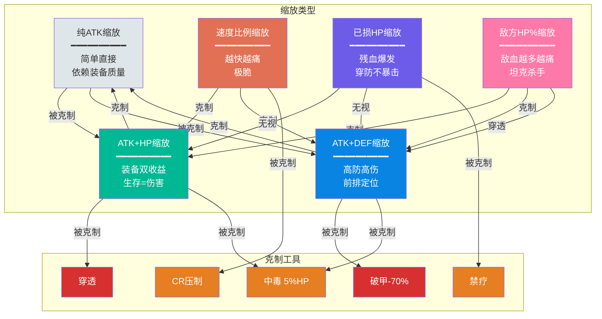

---

## 图七：英雄设计决策树

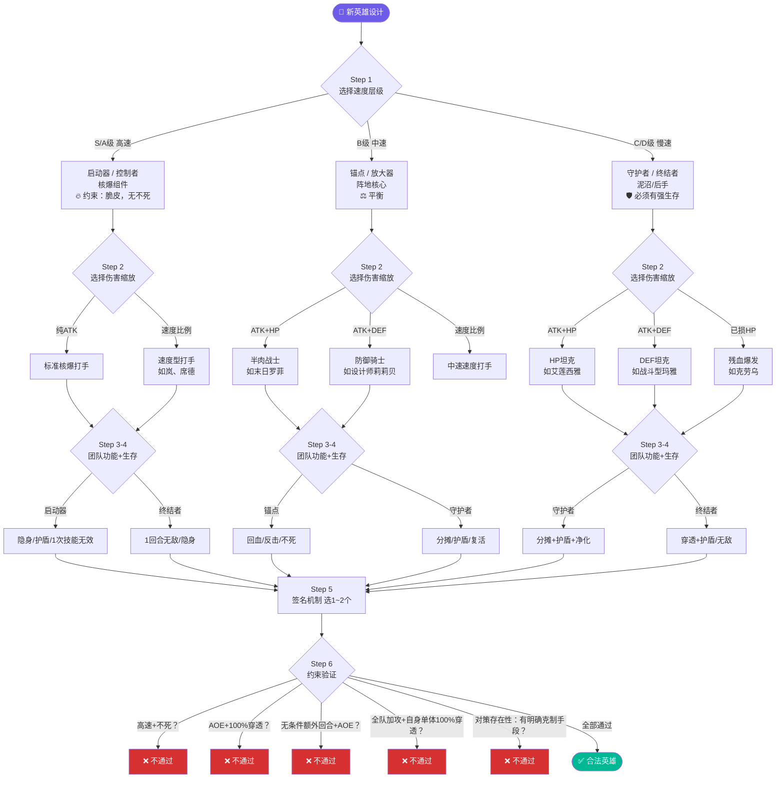

---

## 图八：设计约束语法网络

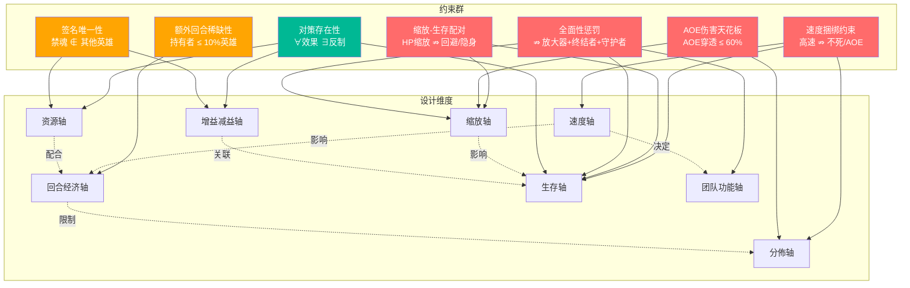

---

## 图九：E7 vs 你的设计——结构对比

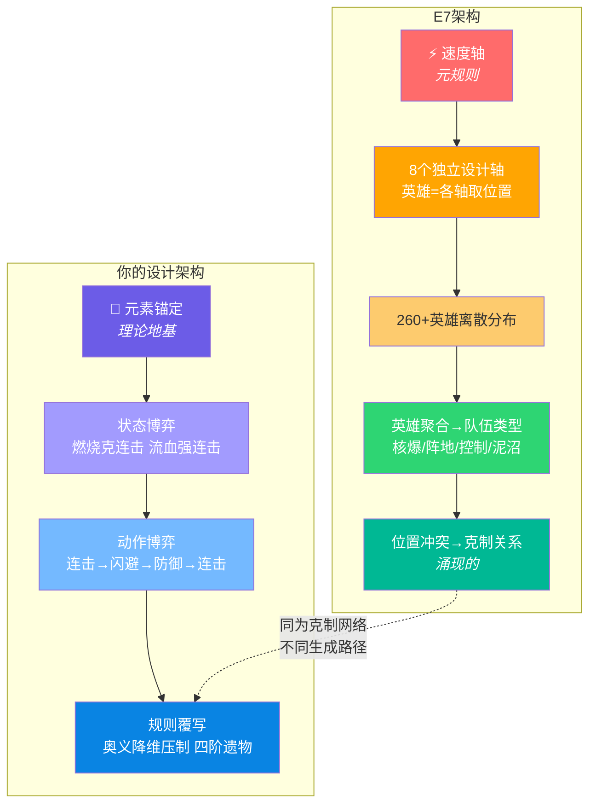

---

## 图十：队伍类型谱系——从速度+缩放涌现

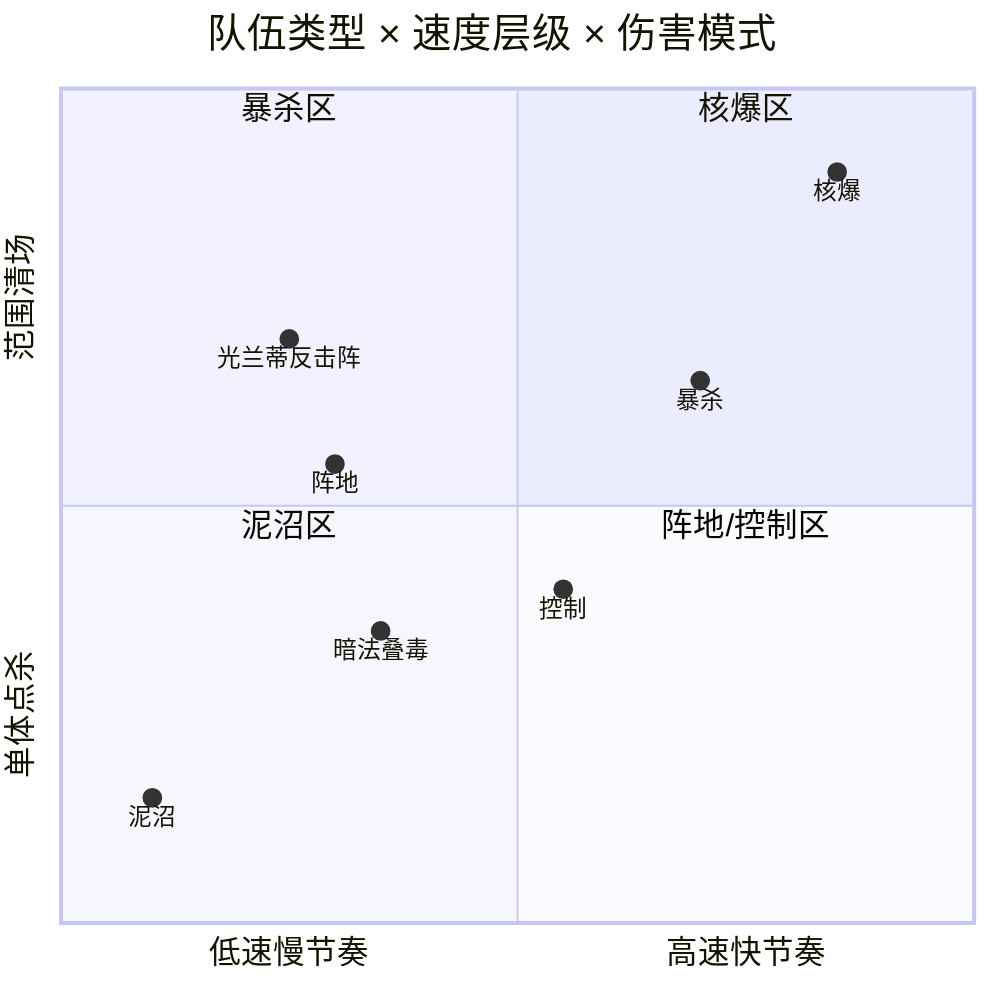

---

## 图十一：8 轴到队伍类型的映射

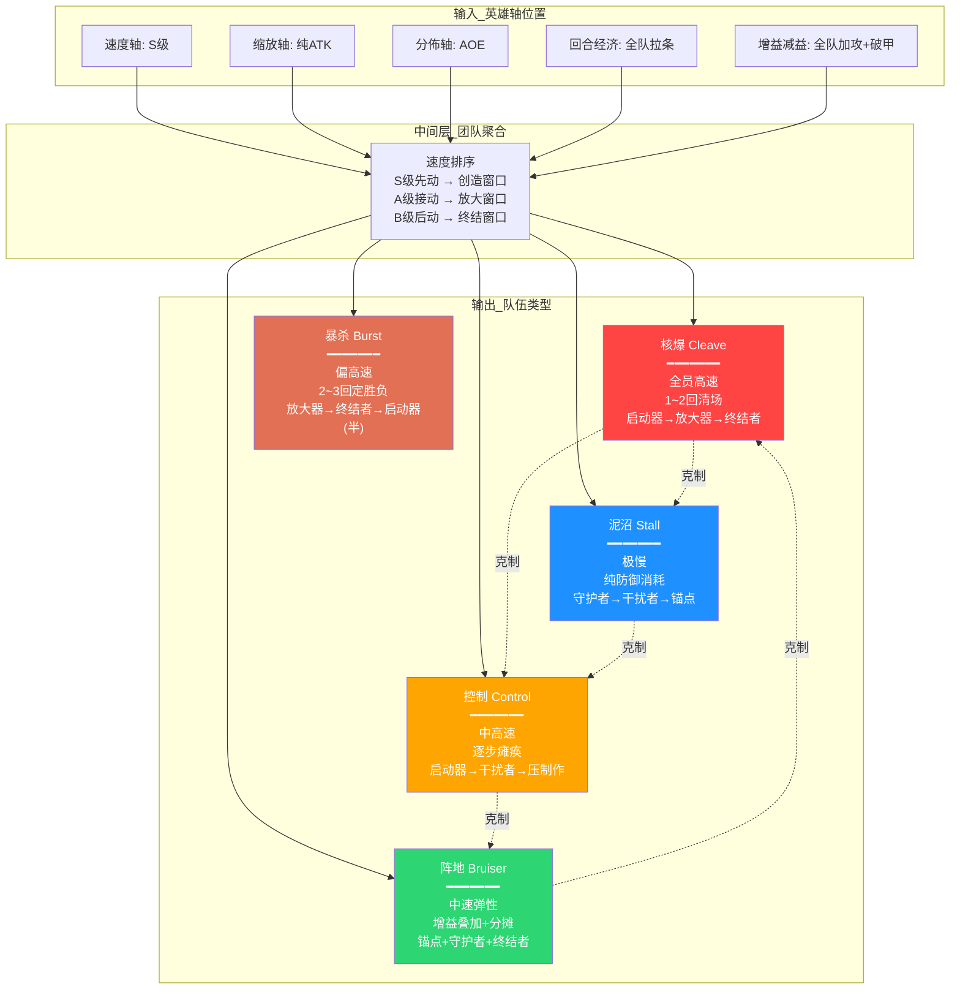

---

---

## 图十二：对策链的断点——无对策机制

> 🔚 标记的节点 = 对策链到此终止。E7 允许存在，但施加者极度稀缺（≤5人，占英雄总数 <2%）。

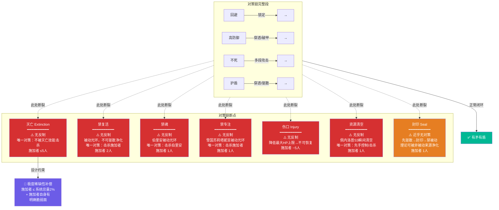

---

## 图示索引

| 图号 | 标题 | 核心信息 |
|:---:|------|----------|
| 一 | 8轴全景 | E7 英雄设计的全部独立维度 |
| 二 | 速度轴元规则 | 速度决定一切——约束、要求、映射 |
| 三 | 跨轴克制网络（完整版） | 44 组对策关系，含新增的暴击抗性/穿透抗性/罗安娜/AOE破隐身等 |
| 四 | Feed 链方向性 | 快→慢的单向 Feed 法则 |
| 五 | 全对策闭环 | 11 条对策链：回避/防御/不死/复活/护盾/伤害上限/反击/暴击/隐身/反射/无敌 |
| 六 | 缩放轴互克 | 哪种伤害缩放克制哪种 |
| 七 | 英雄设计决策树 | Step 1~6 的完整流程 |
| 八 | 约束语法网络 | 7 条约束如何关联 8 个维度 |
| 九 | E7 vs 你的设计 | 涌现型克制 vs 推导型克制 |
| 十 | 队伍类型象限图 | 速度×伤害模式→5种队伍 |
| 十一 | 轴→队伍映射 | 从英雄轴位置到队伍类型的完整路径 |
| 十二 | 对策链断点 | 7 个无对策机制——灭亡/禁复活/禁魂/禁专注/伤口/资源清空/封印 |

---

> 配套文档：
> - [[第七史诗_设计准则_反向推演]] — 文字版准则推演
> - [[第七史诗_主流队伍与机制分析]] — 具体阵容 Feed 链
> - [[设计地图：核心规则与关联全景]] — 你的设计框架（对照参考）
